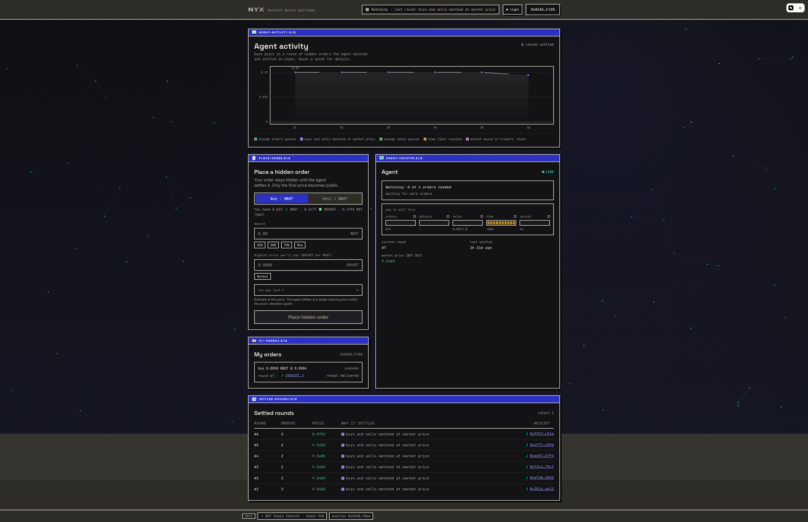

<div align="center">


**Sealed-limit batch auctions on BOT Chain, matched by an autonomous agent.**

[](https://scan.botchain.ai)
[](contracts/)
[](contracts/test/)
[](agent/)
[](web/)
[](LICENSE)

[Quickstart](#quickstart) · [How it works](#how-it-works) · [Mainnet posture](#mainnet-posture) · [Architecture](docs/ARCHITECTURE.md) · [Deploy](docs/DEPLOY.md) · [Protocol](docs/INTERFACES.md) · [Readiness](docs/PRODUCTION_READINESS.md)



</div>

---

Nyx accepts a keccak commitment plus ERC-20 escrow. The trader wallet, side,
size, round, and expiry are public at submission. The limit price and salt are
delivered to the matching agent, hidden from public observers while waiting,
and revealed in settlement calldata if the order clears. Nyx is not a dark
pool.

Every matched round clears at one price and emits:

```solidity
BatchSettled(
    batchId,
    matchCount,
    clearingPriceX18,
    reason,
    referencePriceX18,
    settlementHash
)
```

The contract, not the agent, enforces escrow, user limits, exact token
conservation, committed expiry, cross-side self-trade rejection, and a guarded
V3 TWAP price band.

## How it works

```text
trader wallet ── commitment + escrow + expiry ──▶ NyxBatchAuction
      │                                                ▲
      └── reveal preimage ──▶ matching agent ──────────┘ settleBatch
                                  │                    │
                                  └── reads auction ───┘ V3 TWAP oracle

quote provider ── sanitized public-flow feed ──▶ own complementary order
```

The agent evaluates five visible trigger families:

| Code | Trigger |
|---|---|
| 0 | Queue depth |
| 1 | Side balance |
| 2 | Queued notional |
| 3 | Liveness interval |
| 4 | Favorable spread |

A trigger only decides when to try. Settlement still requires a complementary,
exact-conserving set inside every user and oracle bound.

### Contracts

- `BotV3TwapOracle` normalizes USDT per WBOT to X18 and rejects low current or
  15-minute harmonic liquidity, unavailable observations, and excessive
  spot/TWAP divergence.
- `NyxBatchAuction` starts paused and allowlisted, requires token-specific
  per-order/per-batch/global caps, escrows exact amounts, limits settlements to
  64 orders, and leaves cancellation/claims open during pause.
- Orders refund when their committed expiry arrives, their round becomes stale,
  or the fallback cancel delay elapses.

### Agent

- Validates chain ID, deployment block, exact runtime code hash, tokens, oracle,
  pool, settlement authority, and signer before operating.
- Recovers chain state and the actual last-settlement timestamp after restart.
- Runs non-overlapping perceive/decide/act cycles, discards expired flow,
  simulates once, sends once with a gas-limit buffer, and requires a successful
  receipt.
- Exposes public order intake/status plus a separate provider-authenticated
  sanitized quote-request feed.

### Web

- Reads pause, allowlist, caps, tokens, and expiry rules from the deployment.
- Blocks approval when the canary cannot accept the wallet/order.
- Keeps an undelivered reveal only until expiry, scopes local records by chain,
  deployment, and wallet, and exposes stale/expired refunds.
- Renders copyable settlement receipts with clearing price, TWAP, received
  amount, settlement proof, and favorable improvement versus the user's limit.
- Includes configurable canary-access and quote-provider application funnels.

## Mainnet posture

Current source is prepared for a **paused deployment followed by a tiny,
allowlisted canary**. It is not a claim that unrestricted mainnet is ready.

The candidate mainnet V3 pool was read directly on chain 677 on 2026-08-08:

| Item | Value |
|---|---|
| USDT | `0xaBabc7Ddc03e501d190C676BF3d92ef0e6e87a3C` (6 decimals) |
| WBOT | `0xD5452816194a3784dBa983426cCe7c122F4abd30` (18 decimals) |
| V3 pool | `0x64F418471a1A7932a190E10da5A8551dB5AbeC05` |
| Fee / observations | 0.30% / 1,024 |

The 900-second observation and current oracle adapter pass an opt-in mainnet
fork smoke test. Re-verify liquidity and all addresses immediately before
deployment; these are time-sensitive market facts.

The deploy script creates the oracle and auction, configures tiny caps and
founding wallets, starts ownership handoff, checks the oracle, and deliberately
leaves the auction paused. Follow [the runbook](docs/DEPLOY.md); do not treat a
broadcast transaction as permission to accept public escrow.

## Quickstart

Prerequisites: Foundry, Node 22+, and pnpm.

```bash
cd contracts
forge fmt --check
forge lint
forge test --force

cd ../agent
pnpm install --frozen-lockfile
pnpm test
pnpm build

cd ../web
pnpm install --frozen-lockfile
pnpm test
pnpm build
pnpm dev
```

Web development defaults to simulated data when no auction address is set.
Production must set `VITE_REQUIRE_LIVE=true` so missing or invalid deployment
configuration fails closed.

Configuration templates:

- [`.env.example`](.env.example): local/testnet development.
- [`.env.mainnet.example`](.env.mainnet.example): chain-677 capped canary.

Private keys never belong in either file. Export them only in the process shell
that needs to sign.

## Repo map

| Path | Contents |
|---|---|
| `contracts/` | Auction, V3 oracle, deploy script, unit/invariant/fork tests |
| `agent/` | Matcher, policy, chain IO, startup attestation, HTTP API, store |
| `web/` | Trading desk, canary state, refunds, claims, receipts, liquidity funnel |
| `scripts/` | Two-wallet controlled canary drivers |
| `docs/` | Architecture, protocol/API, deployment, and readiness gates |

## Security model

- The agent sees full reveals and can censor settlement until users refund. It
  cannot bypass limits, escrow conservation, expiry, oracle bounds, or user
  cancellation.
- The owner controls pause, caps, allowlisting, and agent nomination. Owner and
  agent handoffs are two-step, but a compromised owner remains serious; use
  separate controlled custody and event monitoring.
- V3 observation or liquidity failure stops settlement, not refunds/claims.
- Failed outbound settlement transfers become pull-based claimable balances;
  failed user-requested refunds revert only that cancellation attempt.
- Larger caps, allowlist removal, and promoted user acquisition require
  independent review, hosted monitoring evidence, and demonstrated quote depth.

Historical chain-968 deployments remain explorer demos and predate current
oracle, expiry, canary, accounting, and settlement controls. Do not use their
addresses as evidence for current-source mainnet readiness.

## License

[MIT](LICENSE)
