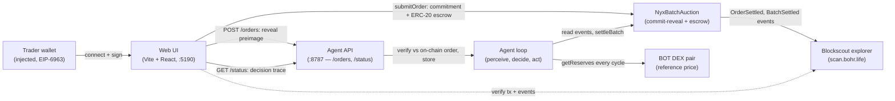
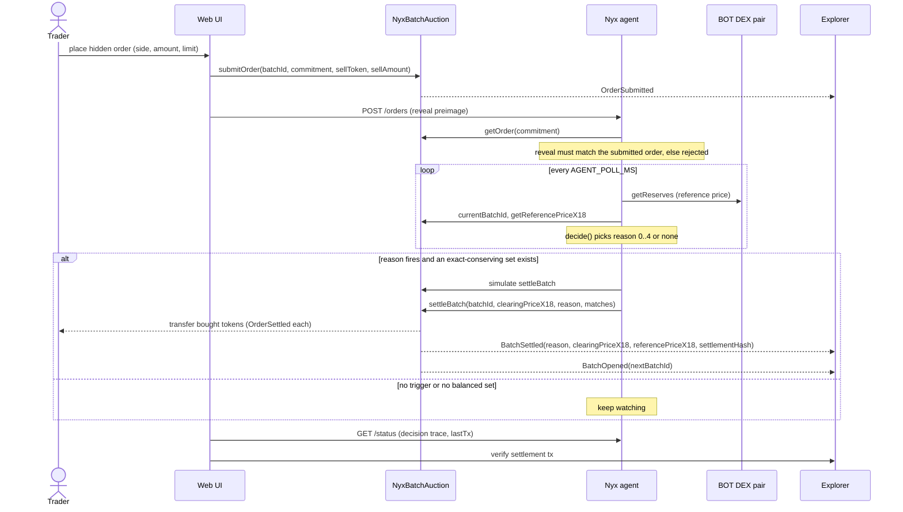
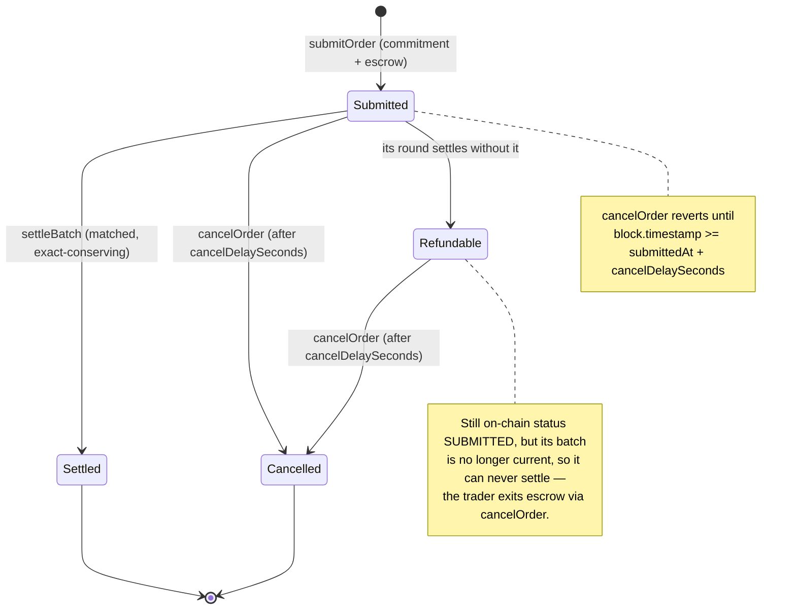
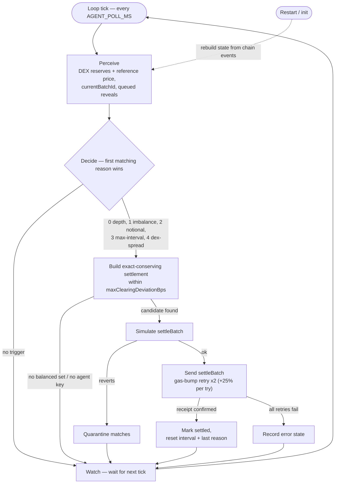

# Nyx — Architecture

How the three components fit together and how a sealed order becomes an on-chain
settlement. The contract is the source of truth; the diagrams below trace the
current hardened source (immutable clearing-price guard, two-step agent
rotation), not the older live demo deployment. See
[INTERFACES.md](INTERFACES.md) for exact signatures and
[DEPLOY.md](DEPLOY.md) for the runbook.

## System overview

A trader connects a wallet to the web UI, which submits the on-chain commitment
plus token escrow to `NyxBatchAuction` and then hands the matching reveal
preimage to the agent's local API — the commitment goes on-chain, the preimage
never does. The agent loop reads the BOT DEX pair for a live reference price
every cycle and reads auction events, then signs `settleBatch`. The web UI polls
`/status` for the agent's decision trace and links out to the explorer so every
claim is independently verifiable.

## Settlement sequence

Sealing is two messages: the commitment and escrow land on-chain, then the
preimage is POSTed to the agent, which rejects any reveal that does not match
the stored on-chain order. On each cycle the agent reads the DEX reference price
and current batch, then evaluates its reason codes. When a reason fires and a
balanced, in-band settlement exists, the agent simulates first and only then
signs `settleBatch`, which pays out every matched order and emits `BatchSettled`
with the reason and settlement hash for the UI and explorer.

## Order lifecycle

An order lives on-chain as one of four statuses: `NONE`, `SUBMITTED`, `SETTLED`,
`CANCELLED`. `submitOrder` escrows the funds and marks it `SUBMITTED`; from there
it either gets matched into a `settleBatch` and becomes `SETTLED`, or the trader
reclaims escrow with `cancelOrder`. `cancelOrder` is guarded by the cancel delay
(`block.timestamp >= submittedAt + cancelDelaySeconds`), which guarantees an exit
even if the agent never settles. Orders are scoped to their round — once their
batch advances unmatched they are effectively "refundable": still `SUBMITTED`
on-chain but no longer settleable, so the only remaining move is `cancelOrder`.

## Agent loop

Every tick the agent perceives (DEX price, current batch, queued reveals),
decides (the five reason codes evaluated in priority order, first match wins, or
none), then acts. Acting means building an exactly token-conserving settlement
within the clearing-price band, simulating it, and only then sending — a
simulation revert quarantines the offending matches instead of broadcasting a
doomed transaction, and sends are retried with a rising gas bump. On restart the
loop rebuilds its view of every order from on-chain events before it resumes, so
a crash never loses or double-settles state.
