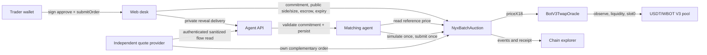
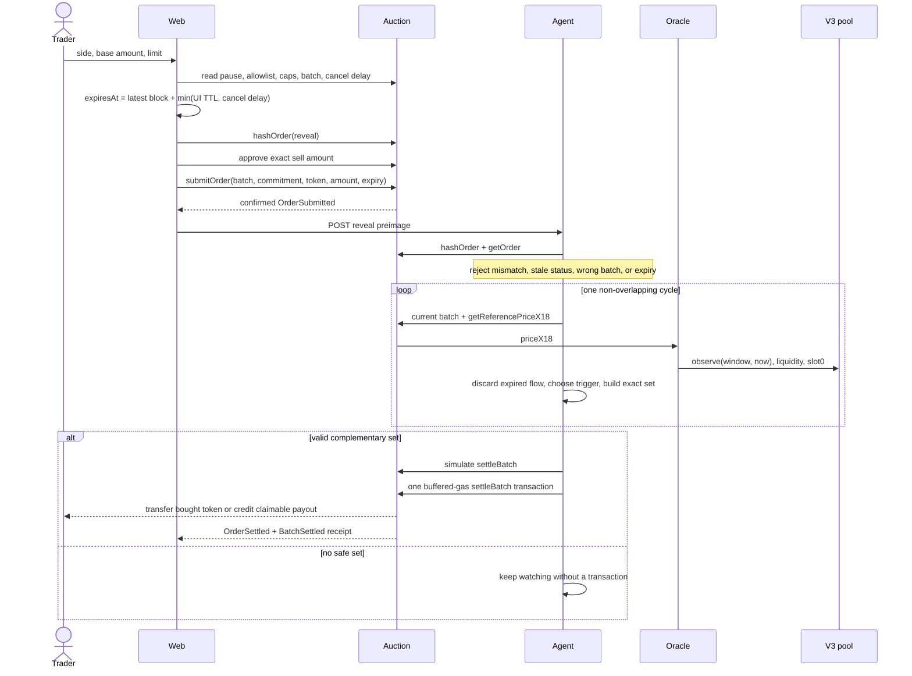
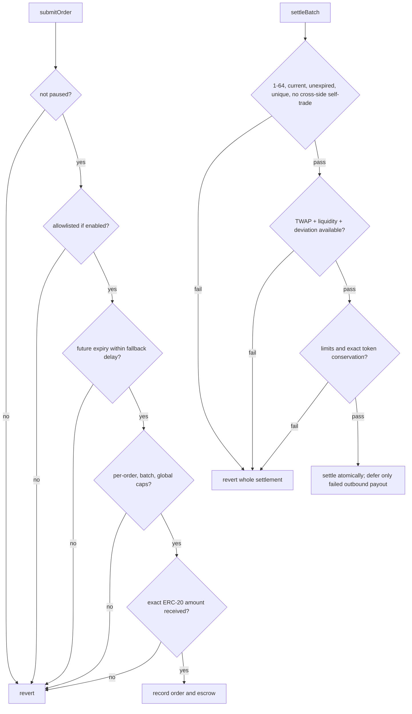
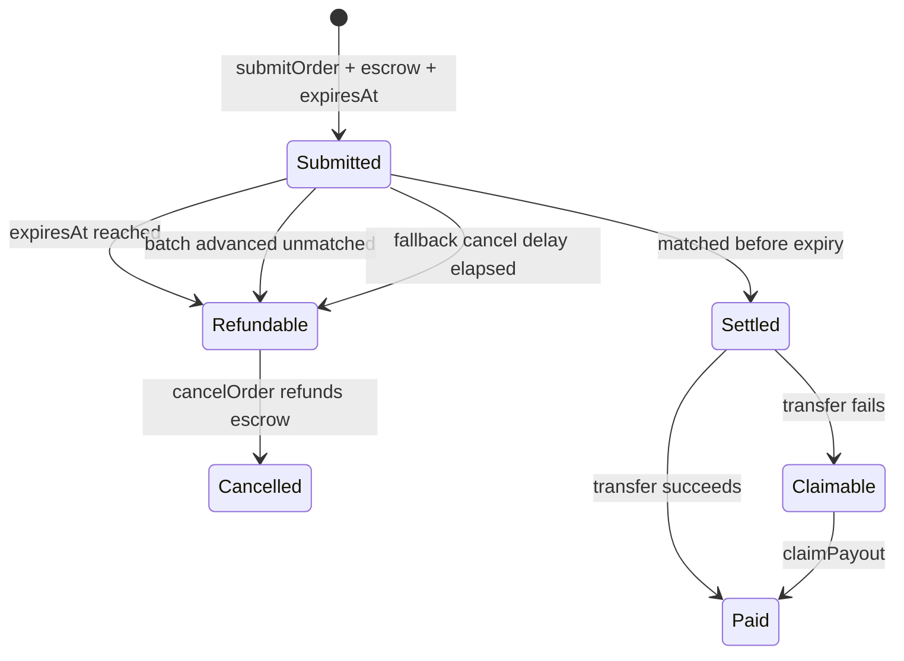
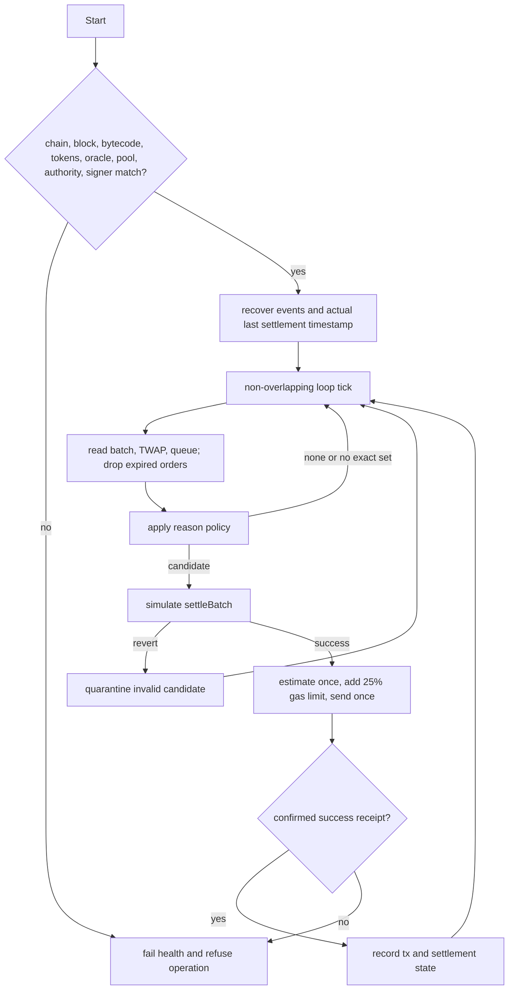

# Nyx Architecture

Nyx has four required runtime pieces: trader web, escrow auction, matching
agent, and a narrow V3 oracle adapter. Quote providers are optional independent
participants, not a privileged solver layer.

## End-to-end data flow

Dependency boundaries are intentional:

- The V3 pool supplies observations; it does not settle user orders.
- The agent supplies timing and matching; the contract enforces value safety.
- The quote-provider feed supplies sanitized demand awareness; it does not
  custody inventory, choose provider risk, or execute hedges.
- The browser stores only its own recent order records and an undelivered
  reveal until committed expiry. Chain state remains canonical.

## Order sequence

The reveal is hidden from public observers only while waiting. The matching
agent sees it after delivery, and successful settlement calldata publishes it.

## Contract controls

The auction starts paused. Risk limits and allowlist mode can change only while
paused. Pause blocks new submissions and settlements but never blocks user
refunds or payout claims.

## Order lifecycle

`Refundable` and `Claimable` are explanatory states, not additional contract
status values. A refundable order remains `SUBMITTED` until cancellation; a
claimable order is already `SETTLED`.

## Agent lifecycle

The agent does not replay an ambiguously submitted settlement with a gas-bump
loop. Recovery reads chain events, so local restart state cannot overwrite the
contract's settlement truth.

## Authority and failure model

- Owner controls pause, caps, allowlist, and agent nomination. Ownership and
  agent changes are two-step acceptances.
- Agent can choose when and which safe complementary set to settle. It cannot
  transfer arbitrary escrow or bypass limits/oracle/expiry.
- Oracle depends on V3 observations and liquidity. Unavailability fails closed,
  which can stop settlement; expiry and cancellation remain available.
- A malicious or offline agent can censor settlement until users refund. It
  cannot prevent expiry/stale/fallback cancellation.
- A compromised owner can change controls or nominate an agent. Use separate
  controlled custody and monitor every authority/configuration event.
